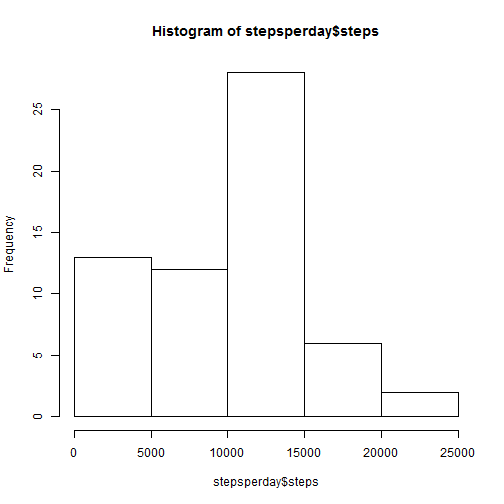

# Reproducible Research: Peer Assessment 1
===========================================

This assignment makes use of data from a personal activity monitoring device. This device collects data at 5 minute intervals through out the day. The data consists of two months of data from an anonymous individual collected during the months of October and November, 2012 and include the number of steps taken in 5 minute intervals each day.

## Loading and preprocessing the data


```r
setwd("C:\\rproj\\Reproducible_Research\\assign1\\")
fileUrl <- "https://d396qusza40orc.cloudfront.net/repdata%2Fdata%2Factivity.zip"
download.file(fileUrl, destfile="data.zip")
```

```
## Error: unsupported URL scheme
```

```r
data <- unzip("data.zip")
activity <- read.csv(data, sep=",", head = T, colClasses = c("numeric", "Date", "numeric"))
str(activity)
```

```
## 'data.frame':	17568 obs. of  3 variables:
##  $ steps   : num  NA NA NA NA NA NA NA NA NA NA ...
##  $ date    : Date, format: "2012-10-01" "2012-10-01" ...
##  $ interval: num  0 5 10 15 20 25 30 35 40 45 ...
```


## Histogram of the total number of steps taken each day

```r
library(reshape2)
stepsperday <- activity[,c("steps","date")]
stepsperday = melt(stepsperday, id = c("date"))
stepsperday <- dcast(stepsperday, formula =date ~ variable, sum,na.rm=TRUE)
hist(stepsperday$steps)
```

 

## What is mean total number of steps taken per day?

```r
stepsmean <- mean(stepsperday$steps)
stepsmedian <- median(stepsperday$steps)
summary(stepsperday)
```

```
##       date                steps      
##  Min.   :2012-10-01   Min.   :    0  
##  1st Qu.:2012-10-16   1st Qu.: 6778  
##  Median :2012-10-31   Median :10395  
##  Mean   :2012-10-31   Mean   : 9354  
##  3rd Qu.:2012-11-15   3rd Qu.:12811  
##  Max.   :2012-11-30   Max.   :21194
```
The mean and median of total number of steps taken per day are 9354.2295 and 1.0395 &times; 10<sup>4</sup> respectively.


